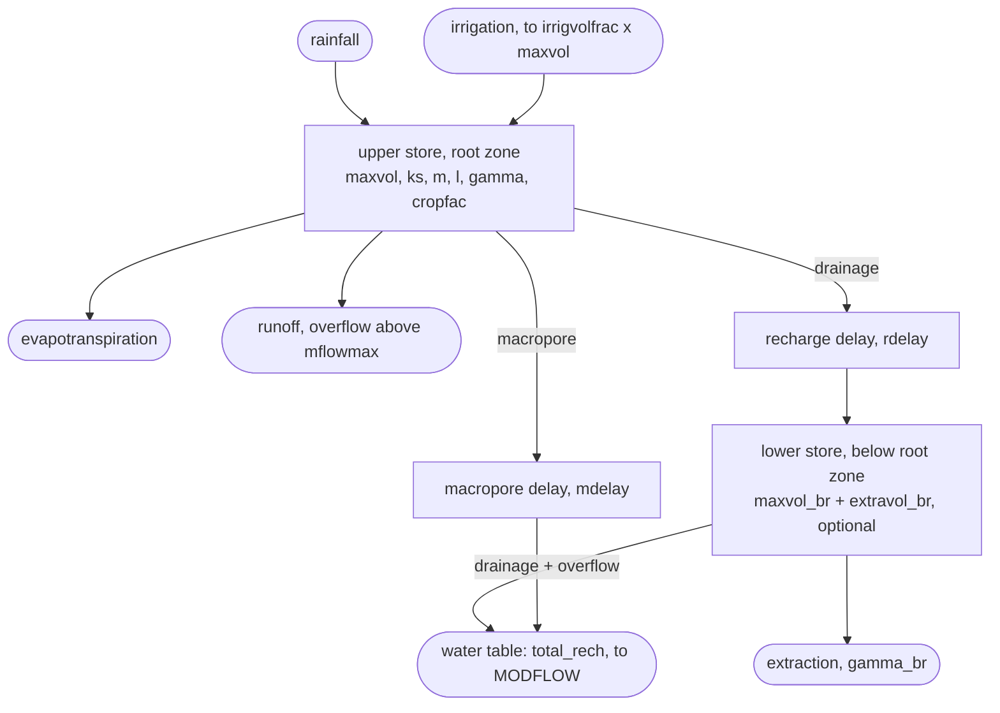

# lumpyrem Conversion Plan

A phased port of the LUMPREM lumped-parameter recharge model to Python, adding
array-based forcing and output, a modern API, and compiled-speed execution.

| | |
|---|---|
| **Reviewed** | `lumprem.f`, `lumprem2.f`, `rechmod.f`, `rechmod2.f`, `lumprep.f90`, `lr2series.f90` (7,985 lines) |
| **Docs** | `documentation/lumprem.pdf`, `documentation/lumprem2.pdf` |
| **Published version** | <https://claude.ai/code/artifact/18e39fc0-5cff-422b-ac01-5922a6fe3850> |

---

## Scope decisions

Confirmed, and reflected throughout what follows.

- **Dropped — legacy file format compatibility.** The `.in` control file, the
  fixed-width tabular writer and the site-sample output are not supported
  features. The reader and writer survive as *test fixtures only* — the Fortran
  oracle reads nothing else, so Phase 0 still needs them.
- **Dropped — LUMPREP.** No SILO text parsing, no generated batch files, no
  partial PEST control files. Climate data arrives as a DataFrame; PEST
  integration goes through pyEMU instead.
- **Settled — the rebuilt Fortran is the reference.** The shipped example output
  is wrong on `elevation` and `depth-to-water`. Golden files are generated from
  source, and no compatibility is owed to the 2020 output. *Confirmed in Phase
  0: rebuilding v1 reproduces the 17 water-balance columns exactly and differs
  on elevation by 1.094 m, exactly as described.*
- **Amended in Phase 0 — the reference carries one parser bug fix.** Selecting
  the lower store for the volume-to-elevation conversion is unreachable in
  `lumprem2.f`: the statement that strips the `lower` keyword out of the line
  buffer sits after an unconditional `go to 9998`, so the word survives and is
  then parsed as `ELEVMIN`. Every such run dies. The oracle build revives that
  dead statement. It cannot change any input that works today — the only inputs
  it affects are ones that currently abort — and without it trap 8's lower-store
  branch would have no reference behind it at all.

---

## 1. What the review turned up

Four things came out of reading the source and testing it that shape everything
below. Each was verified by building and running the Fortran rather than taken
on inspection.

### 1.1 The Fortran builds and runs on macOS — verified

Only Windows `.exe` files ship with the repo, but both models compile cleanly
with `gfortran -std=legacy` and run. That means a live reference implementation
is available throughout the port, not just frozen example output.

```
gfortran -O2 -std=legacy -o lumprem2 lumprem2.f rechmod2.f
gfortran -O2 -std=legacy -o lumprem1 lumprem.f  rechmod.f

$ ./lumprem1 lr_lm1.in out.out     # 3,627 days x 5 steps/day -> 20 ms
```

### 1.2 The shipped example output is stale — confirmed

Rebuilding v1 from source reproduces `lumprem_test.out` exactly on all 17
water-balance columns, and disagrees on `elevation` and `depth-to-water` by up
to 1.09 m. The shipped file has elevation frozen at its initial value for every
output time; the current source recomputes it each step, which is what equation
2.3 describes. The example output is dated 2020, the source 2022 — it predates a
fix.

```
column          max |rebuilt - shipped|
volume ... runoff        0.000e+00      <- 17 columns, exact
elevation                1.094e+00      <- shipped file is wrong
depth-to-water           1.094e+00
```

Confirmed: the source is right, the file is stale. The regression oracle is
*the Fortran rebuilt from source*, and no fidelity is owed to the shipped
outputs.

### 1.3 A faithful Python port reproduces Fortran to 1–2 ULP — prototyped

`rechmod` (upper store) was ported to plain Python and run against the shipped
example, comparing to a Fortran build patched to print 17 significant figures
instead of 7. Agreement is at the floating-point noise floor — the remaining
difference is summation order, not algorithm.

```
worst relative difference vs full-precision Fortran   3.7e-16
float64 machine epsilon                               2.2e-16
volume, irrigation, runoff, gw_withdrawal             0.0e+00  (bit-identical)
```

This is the single most important result here: exact fidelity is achievable, so
it can be made a hard gate on every phase rather than a hope.

### 1.4 NumPy vectorisation across cells does *not* solve the speed problem — measured

The obvious array design — hold *N* cells in arrays and step them together —
loses, because the day → substep → Picard-iteration nest is irreducibly
sequential. A 10-year run is ~18,000 sequential steps, and each one pays NumPy's
per-call overhead on ~30 temporaries no matter how few cells there are. See
section 3.

---

## 2. What is actually being ported

LUMPREM2 is two soil-moisture stores and two delay buffers. All the physics lives
in one subroutine, `rechmod`, which is ~300 lines; everything else in the 8,000
lines is file parsing, error checking and output formatting. With the legacy
format dropped, almost all of that remainder is simply not ported — **the
conversion is a 300-line problem wrapped in test infrastructure**, which is why
the fidelity gates below can be set so tight.



With the lower store disabled (`maxvol_br = 0`) the model collapses to LUMPREM
v1: recharge is then upper-store drainage plus macropore flow, and both carry
their delay. With it enabled, only macropore flow is delayed — upper-store
drainage is delayed on its way *into* the lower store instead.

---

## 3. The speed question, settled

The array extension is what makes performance a real constraint. One model is
cheap — 20 ms for ten years. A thousand cells inside a PEST calibration loop is
not, and that is the use case the array support exists to serve.

Both candidate Python strategies were measured against the Fortran on the same
10-year, 5-steps-per-day workload:

| Strategy | Cells | ms / cell | vs Fortran | Verdict |
|---|---:|---:|---:|---|
| Fortran `-O2` | 1 | 20 | 1.0x | baseline |
| Pure Python loop | 1 | 1,043 | 52x slower | correct, unusable at scale |
| NumPy, vectorised over cells | 100 | 335 | 17x slower | overhead dominates |
| NumPy, vectorised over cells | 1,000 | 73 | 3.7x slower | still losing |
| NumPy, vectorised over cells | 10,000 | 45 | 2.2x slower | never catches up |
| **Numba `njit` + `prange` over cells** | any | — | ~1x x cores | **the plan** — *measured in Phase 3, below* |

NumPy amortises its overhead only as cell count grows, and even at 10,000 cells
it stays twice as slow as one core of Fortran. Numba is the right tool here
precisely because the loop nest is sequential: it compiles the scalar kernel as
written — preserving the Picard iteration exactly — and `prange` then
parallelises across cells, which *are* independent. That should land at Fortran
speed per core, multiplied by core count.

> **Benchmarked at the start of Phase 3 — it holds.** On the same ten-year,
> five-substep workload, the compiled kernel runs at **0.94–0.97x the time of
> `rechmod2.f`** per cell on one core (M4 Max, gfortran `-O2`), returns a
> checksum identical to the Fortran's, and reaches **~10x on the 12
> performance cores**. The 20 ms figure above is the whole executable
> including file I/O; `scripts/benchmark_numba.py` calls `rechmod` from a small
> Fortran harness instead, which puts the reference at 5.2 ms (one store) and
> 9.7 ms (two stores), and times Numba against that.

---

## 4. Target architecture

Four layers, each usable on its own. The kernel is the only part held to
bit-fidelity; everything above it is free to be designed rather than translated.

| Layer | Module | Responsibility |
|---|---|---|
| **Kernel** | `lumpyrem.core`, `lumpyrem.compiled`, `lumpyrem.engine` | `rechmod`; float64 scalars and arrays only, no I/O, no objects. The thing that must be bit-faithful. *As built: `core` is the readable translation, `compiled` its Numba build, and `engine` packs cells into rows and picks between them; see Phase 3.* |
| **Model** | `lumpyrem.model`, `lumpyrem.parameters` | `Model` and `ModelGrid`: typed parameter objects, forcing, solver settings, `.run()` → results. |
| **I/O** | `lumpyrem.forcing`, `lumpyrem.results`, `lumpyrem.io` | Forcing in from DataFrame / array / CSV / netCDF; results out as DataFrame, xarray or CSV. No fixed-format files. *CSV and DataFrames stay as constructors and methods (Phase 2); `lumpyrem.io` holds xarray and netCDF (Phase 3).* |
| **Coupling** | `lumpyrem.mf6` | MODFLOW 6 handoff via flopy, MF6 time series, and pyEMU parameterisation for calibration. |
| *— tests only —* | `tests/oracle` | Legacy `.in` writer and tabular reader, used solely to drive and read the Fortran reference. Never imported by the package. |

---

## 5. Phased conversion

Six phases, each ending in a gate that is a test rather than a judgement call.
Week ranges are estimates for one developer working steadily, and assume the gate
is enforced — most of the effort in phases 0–1 is test infrastructure, not
translation.

### Phase 0 — Oracle and scaffolding (1 week) — **complete**

Build the thing that tells you whether every later phase is correct. Do this
before writing a line of model code.

- Package skeleton: `src/lumpyrem/`, `pyproject.toml`, ruff, pytest, GitHub
  Actions on Linux/macOS/Windows.
- Vendor the Fortran sources; add a build script that compiles them with
  gfortran, patched to emit 17 significant figures.
- Write the legacy `.in` writer and tabular reader **under `tests/`**. This is
  the one piece of legacy-format code that must exist, because the reference
  binary accepts nothing else. It is a fixture, not an API.
- Write a case generator: randomised but valid parameter sets across both the
  one-store and two-store configurations, spanning irrigation on/off, fractional
  and zero delays, empty and full stores, zero rainfall and extreme rainfall.
- Emit **dense daily forcing** in the generated cases — a value for every day.
  That makes the Fortran's three gap-filling rules no-ops, so they never
  contaminate the fidelity comparison and can be tested separately as a Python
  feature.
- Run the Fortran over ~200 such cases and freeze the full-precision outputs as
  golden files in the repo.

*As built:* 207 cases (41 structured, one per trap, plus randomised fill),
0.5 MB gzipped, regenerating in ~14 s. Precision comes from widening the CSV
writer to `1pe26.17`, which leaves the fixed-width tabular writer byte-
comparable with the shipped 2020 examples. A further 36 candidate cases were
dropped because the reference cannot solve them at any substep count — see
*Stiff configurations have no reference* below.

> **Gate** — Golden files regenerate **byte-for-byte** on the platform that
> generated them, from a clean checkout and a fresh compile. Across platforms a
> tolerance applies rather than byte-identity; see *Transcendentals are not
> portable* below. **Met**, byte-identity verified on macOS/arm64, locally and
> on the CI runner.

### Phase 1 — Faithful kernel port (1 week) — **complete**

A literal translation of the physics and nothing else. Resist improving anything
here — the fidelity traps in section 6 are all places where a tidier rewrite
silently changes answers.

- Port `rechmod2` in full, both stores, in plain Python/NumPy scalar form.
- Port the water-balance audit and the volume-to-elevation conversion, including
  its clamping (trap 8).
- Drive it from a plain function signature — parameters and dense daily forcing
  arrays in, result arrays out. No file layer at all at this stage.

*As built:* `lumpyrem.core` — `drainage`, `evap`, `rechmod` and the
`lumprem2.f` simulation loop, ~570 lines of scalar Python. Traps 13 and 14 are
**reproduced, not repaired**: the Phase 1 gate is bit-fidelity, and both defects
are in the golden files. A fix belongs above the kernel, as an opt-in, once
there is an API to put it in.

Coverage is checked rather than asserted. `tests/test_kernel_mutations.py`
reintroduces each trap in turn and requires the golden set to reject it. That
survey is what turned up the two demotions below, and it caught a real gap: no
case exercised trap 5 at all until `empty_store_fixup` was added for it.

> **Gate** — All 209 golden cases agree to <= 10 ULP on every column. **Met, at
> 0 ULP** — every column of every case is bit-identical, not merely within
> budget. The budget stays at 10 so that Phase 3's reordering has room.

### Phase 2 — The Python API (1–2 weeks) — **complete**

Where the "easier user interface" goal is delivered. With no legacy format to
preserve, this layer is designed from scratch against how the model is actually
used.

- Typed parameter objects — `UpperStore`, `LowerStore`, `Solver`,
  `VolumeToElevation` — with validation and errors that point at the offending
  value.
- Forcing from a DataFrame, a NumPy array, a CSV or a dict.
- Real dates throughout instead of integer simulation days; output times as a
  date range, a frequency string (`"MS"` for month starts), or explicit days.
- Gap-filling becomes an *explicit, per-variable resampling choice* rather than
  an implicit property of a file format. The Fortran's three rules (trap 11)
  survive as named options — they are hydrologically sensible defaults — but the
  user can see and change them.
- Results as a DataFrame with named columns, plus `.balance_error()`, `.plot()`,
  and `.to_csv()`.

*As built:* `lumpyrem.parameters`, `lumpyrem.forcing`, `lumpyrem.model` and
`lumpyrem.results`. `Model.run(forcing, times=...)` marshals the objects into
the Phase 1 function call and labels what comes back; it adds no arithmetic of
its own, which is what makes the gate below an equality rather than a budget.

Three decisions worth recording:

- **Validation is stricter than the reference, deliberately.** Where
  `lumprem2.f` silently clamps — `gamma_br` into [0.1, 10], both delays at
  `MAXDELAY - 2` — the objects refuse. *(Phase 3 removed the delay ceiling
  altogether, with the fixed buffers; any delay is now accepted.)* A silently clamped parameter is worse
  than an error inside a calibration loop, because the knob keeps turning and
  the model stops responding to it. `veg_gamma <= 0` is rejected too; the
  Fortran evaluates 0/0 there and carries the NaN onwards without comment.
- **A timestamp labels the end of the interval it summarises.** Day 1 covers
  `[start, start + 1 day)`, so an output stamp marks the instant a reporting
  interval closes, and row 0 sits at `start` carrying the initial state. Flux
  columns are interval totals under that convention, which is the same one a
  MODFLOW stress period uses — worth settling now rather than during Phase 4.
- **`lumpyrem.io` was folded in rather than built.** Section 4 sketches a
  separate I/O module, but every reader is a `Forcing` constructor and every
  writer a `Results` method, so a separate module would have held two
  re-exports. It gets content of its own in Phase 3, when xarray and netCDF
  arrive, and can be introduced then.

> **Gate** — Every golden case, expressed through the object API, still
> reproduces the Phase 1 numbers exactly. Resampling options are tested
> independently against hand-built cases. **Met, at 0 ULP**, and the gate was
> checked for teeth the way Phase 1 checked the kernel: four deliberate
> marshalling slips — swapped exponents, swapped delays, a schedule shifted by
> one day, a series plumbed to the wrong variable — are each required to fail
> it. The resampling half went further than hand-built cases: the reference is
> driven from genuinely *sparse* forcing files, which the dense Phase 0 cases
> were designed never to produce, and the Python rules reproduce it exactly.

### Phase 3 — Array-based and compiled (2–3 weeks) — **complete but for one re-measurement**

The main extension, and the one with real engineering risk. Start by
benchmarking Numba, because the whole design rests on it.

- Move the kernel to `@njit(cache=True)`; confirm it still passes the Phase 1
  gate unchanged.
- Add `@njit(parallel=True)` with `prange` over cells. Measure against the
  Fortran baseline before building on it.
- Replace the delay buffers with a ring buffer, **sized to the actual delay**.
  The Fortran shifts a fixed 500-element array every simulated day; at 10,000
  cells that becomes a 5-million-element copy per day for no reason. Dropping the
  format also drops the hardcoded `MAXDELAY = 500` ceiling, so the buffer can
  simply be `ceil(rdelay) + 1` long. Index arithmetic gives identical results at
  zero cost.
- `ModelGrid`: parameters as arrays over *N* cells, forcing either shared or
  per-cell `(ntime, ncell)`.
- Results as an xarray Dataset on `(time, cell, variable)`, so a recharge array
  drops straight into flopy.
- Keep a pure-NumPy fallback path so the package imports and runs without Numba
  installed.

> **Gate** — An *N*-cell run with identical parameters matches *N* single runs
> exactly; per-cell time <= Fortran; scaling is near-linear to physical core
> count. **Correctness and per-cell time: met. Scaling: met at ~85% on 12
> cores as first measured, but under heavy load; to be re-measured on a quiet
> machine before it is quoted.**

*As built:*

- **The compiled kernel.** `lumpyrem.compiled` is the `core` arithmetic
  rewritten into the shape Numba accepts — no dataclasses, no `for`-`else`,
  parameters packed into one float64 row per cell — with `simulate()` as a
  drop-in for `core.simulate()` and `simulate_cells()` running cells under
  `prange`. LLVM keeps the expression order and does not contract to FMAs
  without `fastmath`, so the port survived compilation untouched.
  `error_model="numpy"` lets a zero divisor produce inf/nan as the Fortran
  does instead of raising, and changes nothing for finite inputs. It is held to
  the Phase 1 gate unchanged, **met at 0 ULP on all 209 cases**, and to exact
  equality with `core`: values, output days and non-convergence counts.

- **Delay buffers, sized to the delay.** `compiled` holds each buffer as a
  ring of `int(delay) + 1` slots, and a day's shift is a move of the ring's
  head; `core` keeps the Fortran's shifting array, sized per run to the longest
  delay or initial buffer rather than to 500. Neither changes a number, and
  the argument is short enough to state:
  - a shift moves values without touching them, so it has no rounding to keep;
  - every element past `int(delay) + 1` is zero after the first call's sweep
    (trap 7), and adding zero to a sum that starts at `0.0` is exact, so the
    Fortran's sums over all 500 elements — `totd` and `totm`, and through them
    `vol_drain`, `vol_macro` and `balance` — equal sums over the ring taken in
    the same logical order, newest first;
  - an initial buffer longer than the delay is claimed on the first call, as
    the Fortran's sweep does, summed in its order, and then lost from the lower
    store exactly as trap 14 loses it.

  The plan's `ceil(rdelay) + 1` is one slot too many for a fractional delay:
  trap 7 reads element `int(rdelay) + 1` and nothing past it, and a ring of the
  larger size re-times the release. The mutation survey below carries that
  sizing as a mutation, and 18 cases reject it.

  It pays where the plan expected. On the benchmark workload with daily output,
  the compiled kernel drops from 6.6–7.1 to 3.35 ms per cell (one store) and
  from 8.9–9.3 to 5.8 ms (two stores); with 30-day output, where the Fortran's
  per-call sums were already amortised, nothing changes. The pure-Python
  fallback gains 4–6x on daily output, since it no longer walks 500 elements
  per call. The `MAXDELAY - 2` ceiling is gone with the fixed arrays, so
  `UpperStore` accepts any delay; beyond 498 days the reference cannot follow,
  and there the two buffer implementations, which share no code, are held to
  each other exactly on randomised cases with delays and initial buffers up to
  ~900 and ~1,200 days (`tests/test_delay_buffers.py`).

- **`lumpyrem.engine`, and the fallback without Numba.** The parameter-row
  layout lives in `engine`, which never imports Numba, and `run_cells()` takes
  the compiled kernel when Numba imports and runs `core.simulate()` per cell
  when it does not. `Model.run()` and `ModelGrid.run()` both go through it, and
  take `engine="auto" | "compiled" | "python"`; since the two kernels are held
  to exact equality the choice is speed, never results, and the Phase 2 gate
  now runs on both. *The fallback is `core`, not a NumPy kernel vectorised over
  cells.* Section 3 measured that at 2–17x slower than one core of Fortran, and
  it could not keep bit-identity either: on x86 with AVX-512, NumPy evaluates
  `exp` with its own SIMD routines rather than the maths library's. A test
  runs the package end to end in an interpreter where `import numba` fails.

- **`ModelGrid`.** A grid is a tuple of `Model`s sharing one `Solver` — the
  kernel steps every cell with the same `nstep`, `mxiter` and `tol` — plus
  labels for the cells. `ModelGrid.from_arrays()` takes each parameter field
  as a number shared by every cell or an array with one value per cell, and
  validates each cell as a `Model` would, naming the cell in any error.
  Building 10,000 cells takes 0.16 s and packing them 0.05 s, against ~4 s for
  a ten-year monthly run, so the object layer costs about 5%. Forcing is a
  `Forcing` shared by every cell or a `GridForcing`, whose variables are each an
  `(ntime, ncell)` block, a shared series or a constant; the kernel takes each
  variable as one shared row or one row per cell, so memory grows only with
  what actually differs between cells. The fill rules apply per cell column
  (vectorised when the cells list the same days) and are held to what a plain
  `Forcing` makes of each column alone.

  **The gate: every cell of a grid equals its own `Model.run()`, exactly** —
  values, days and convergence counts — for shared and per-cell forcing, on
  both engines, over the 31 golden cases that share one schedule, and each cell
  reproduces `core.simulate()` called directly and the Fortran reference. It
  has teeth: rows of parameters, initial buffers, per-cell forcing and results
  are each shifted by one cell on purpose, and all four are rejected. A
  `GridForcing` read from a file carries its cell labels, and a grid refuses
  forcing whose labels do not match its own, in order — so a file's column
  order cannot silently re-assign climate to cells either.

- **xarray and netCDF.** `GridResults` keeps `(time, cell, variable)` as its
  `values` array; `results["total_rech"]` is a time-by-cell DataFrame and
  `results.cell(label)` a `Results` identical to the single run.
  `lumpyrem.io` — introduced here, as Phase 2 planned — turns results into a
  Dataset with one variable per column on `(time, cell)`, writes it to netCDF
  losslessly, and reads gridded forcing back as a `GridForcing`. xarray and
  netCDF4 form the `xarray` extra and are imported only when used.

- **Mutation coverage of `compiled`.** `tests/test_compiled_mutations.py`
  does for `compiled` what the core survey does for `core`, against a fresh,
  uncached Numba build of the unmutated module, and adds traps 2 and 12, which
  the core survey leaves to the paired cases. It also carries seven mutations
  of the ring buffers: summing the ring oldest first, dropping the first-call
  claim or releasing it on every call, totalling day 0 over the ring only,
  sizing the ring `ceil(delay) + 1`, never moving the head, and resetting the
  head on every call. **Every mutation is rejected**, by between 9 and 205 of
  the 209 cases, and none by crashing; the summation-order mutation alone moves
  88. Traps 4 and 6 remain provably inert in the compiled build too.

- **Near-linear scaling: provisionally met.** First measured at 2048 cells:
  3.8x on 4 threads, 7.4x on 8, 10.2x on 12 (85% efficiency), 11.7x on 16,
  where the four efficiency cores join — *with the machine at a load average
  of ~65*. Re-run after the ring buffers at a load of 7–11: 0.90–0.91x Fortran
  per cell, checksums exact, and 6.6x on 12 threads, which says more about the
  load than the kernel. The Fortran/Numba ratio is protected by alternating the
  two; absolute times and scaling are not, and still need a quiet machine.
  Cells with a ±20% parameter spread vary in cost, and `prange`'s static
  chunking loses a few percent to that.

### Phase 4 — MODFLOW and PEST coupling (1 week)

Much smaller now that LUMPREP is out of scope. What remains is the part that was
always the point: getting recharge into a groundwater model and parameters into a
calibration.

- `results.to_mf6_timeseries()` — LR2SERIES's job, including the `div_delta_t`
  rate conversion and the stepwise/linear/linearend methods.
- Direct flopy handoff for the array case: a `(time, cell)` recharge array mapped
  onto an RCH package, which for gridded work is a better path than time-series
  files.
- pyEMU parameterisation helpers, replacing the template-file and
  partial-control-file generation that LUMPREP did.
- A couple of convenience climate readers, but no privileged format — the
  interface is a DataFrame.

> **Gate** — A gridded run produces an RCH package flopy accepts and MODFLOW 6
> runs, and a pyEMU-driven calibration completes on a small synthetic case.

### Phase 5 — Documentation and examples (1–2 weeks)

Runs alongside phases 2–4 rather than after them, but needs its own dedicated
time to finish properly.

- MkDocs Material site: theory, API reference from docstrings, and a page on the
  solution scheme and its convergence behaviour.
- Port the physics from the two PDFs into a Theory page with rendered equations
  and the drainage and evapotranspiration response curves regenerated as code —
  figures 2.2 and 2.3 become plots the reader can re-run with their own
  parameters.
- Executable notebooks: single site; calibration against observed heads; gridded
  array run; MODFLOW 6 coupling via flopy.
- A short note for anyone arriving from the Fortran, mapping old variable names
  onto the new API. Not a migration tool — an orientation page.

> **Gate** — Notebooks execute in CI. A reader who has never seen LUMPREM can
> run a model from the README in under five minutes.

---

## 6. Fidelity traps

These are the specific places in `rechmod2.f` and `lumprem2.f` where an idiomatic
rewrite quietly produces different numbers. Every one of them is load-bearing.
They belong in the porting checklist and, ideally, as named test cases.

1. **Crank–Nicolson, not fully implicit.** Drainage and evaporation are evaluated
   at `vd = (tvol + vol) * 0.5 / maxvol`, clipped to [0,1]. The fully implicit
   line sits directly above it, commented out — the manual says Crank–Nicolson
   was chosen for better convergence with respect to step length.
2. **The Picard loop exits carrying the current iterate.** On convergence it
   jumps out using the `rtemp1`, `rtemp2` and `tempvol` from that iteration — it
   does not recompute a converged state. Moving the exit test changes results at
   the tolerance level.
3. **The first iteration never tests convergence.** `if (iter.eq.1) go to 390` —
   a `while` loop that tests up front will exit one iteration early.
4. ~~**Irrigation adds a second convergence criterion.**~~ *Demoted in Phase 1
   — it cannot change results.* When the irrigation code is non-zero, both the
   volume *and* the irrigation increment must satisfy the tolerance. It does
   bind: in 48 of the 209 frozen cases it forces extra iterations. But once
   irrigation fires, `tvol` is pinned to `vvol` from the first iteration
   onwards, so every later iteration computes the same `vd` and returns
   bit-identical `rtemp1`, `rtemp2` and `tempvol`. Exiting early gives the same
   answer. It is an iteration-count detail, not a fidelity risk.
5. **The store-empties fix-up.** When the store is drawn to exactly zero and
   demand exceeded supply, drainage and evaporation are scaled back in proportion
   so the day's balance still closes. Omitting it is invisible in most runs and
   destroys the balance column in dry ones. *It is rarer than it looks: across
   209 randomised and structured cases it never fired productively until a case
   was built for it. Rain must stay at zero in such a case — an empty store
   receiving rain under high demand puts the Picard iteration into a two-cycle
   it never escapes.*
6. ~~**Macropore split uses a strict inequality.**~~ *Demoted in Phase 1 — the
   branches are identical at the boundary.* `if (rtemp1 < mflowmax * tstep)`
   sends everything to macropore flow; otherwise the cap goes to macropore and
   the remainder to runoff. On exact equality the `else` branch adds
   `mflowmax * tstep` to macropore — the same number — and
   `rtemp1 - mflowmax * tstep`, which is exactly `0.0`, to runoff. There is no
   difference to get wrong. Verified by constructing the equality case
   (`nstep = 4`, `ks = 0.25`, `rain = 0.5`, `mflowmax = 0.25`, all binary-exact)
   and by mutating `<` to `<=` across the whole golden set.
7. **Delay buffers split into whole and fractional days.**
   `irdelay = int(rdelay) + 1` and `frdelay = rdelay - int(rdelay)`; each day
   releases `(1 - frdelay)` of the tail element and scales what remains by
   `frdelay`. There is also a first-pass sweep that claims anything sitting
   beyond `irdelay`, which matters when a delay is shortened between calls.
   *In Phase 3 it matters when an initial buffer is longer than the delay:
   the ring buffers are exactly `irdelay` long, so that tail is claimed before
   the ring is filled, in the sweep's order, and released on the first call.*
8. **Elevation clamps before it converts.** It uses `min(vol, maxvol)` — or the
   lower store's volume when that store is active — floored at `1e-10` so a
   negative `power` cannot blow up, then clipped to `[elevmin, elevmax]`.
9. **Groundwater potential evaporation excludes the lower store.**
   `gw_pot_evap = potevapn - evapn`. The version that also subtracts lower-store
   extraction is present in the source and commented out; it was a deliberate
   decision, and the manual explains why.
10. **The lower store's crop factor is hardwired to 1.0.** Marked `! hardwired`
    in the source. Do not expose it as a parameter without deciding that
    explicitly.
11. **The three forcing inputs gap-fill differently.** Vegetation is linearly
    interpolated between listed days; potential evaporation and irrigation are
    forward-filled as steps; rainfall is zero-filled. This is the one trap that is
    no longer a fidelity risk — Phase 0 generates dense daily forcing so the rules
    never fire during oracle comparison. *Closed in Phase 2:* they are now named
    options on `Forcing`, defaulted to these three and overridable per variable,
    and checked against the reference driven from genuinely sparse forcing
    files. Applying one rule to all three remains the easiest way to get
    plausible but wrong answers, which is why the rule is visible in the API
    rather than implied by a file name.
12. **Enabling the lower store re-routes the delays.** Without it, recharge is
    upper-store drainage plus macropore flow and both are delayed. With it,
    upper-store drainage is delayed on the way *into* the lower store, and only
    macropore flow is delayed on the way out.
13. **Irrigation bypasses the store-empties fix-up.** *Found in Phase 0.* The
    fix-up in trap 5 keys on `tempvol == 0`, but irrigation raises `tvol` to
    `vvol` *before* `tempvol` is taken. So when the negative-volume clamp fires
    and irrigation then tops the store up, the fix-up is skipped and the full
    pre-clamp demand is charged against water that was never there. The
    reference creates mass and its own `balance` column goes negative. This is
    a defect, not a subtlety — Phase 1 has to choose explicitly between
    reproducing it and departing from it. Pinned by the case
    `irrig_bypasses_empty_fixup`.
14. **The lower store never receives claimed buffer water.** *Found in Phase 0.*
    `iflag_br` is initialised to 1 and is only cleared inside the branch that
    never runs, so `recharge_for_br` is overwritten each day instead of
    accumulating. Water claimed by the first-pass sweep of trap 7 — anything
    sitting beyond `irdelay` when a call begins — is added to `recharge` but
    never routed into the lower store, and vanishes. The loss is exactly that
    amount, once per affected call. Pinned by `two_store_buffer_claim_lost`.

15. **A single-precision literal sits in a double-precision expression.**
    *Found in Phase 1.* `lumprem2.f` floors the volume before the elevation
    conversion with `if (dtemp .lt. 1.0e-10) dtemp = 1.0e-10`. That literal is a
    default REAL, so the value actually used is `float32(1e-10)` widened —
    `1.00000001335143196e-10`, not `1e-10`. With a negative `power` the
    difference reaches 7e-4, which is millions of ULP. A port that writes the
    constant the obvious way fails the gate.

16. **Interpolation multiplies by a reciprocal rather than dividing.**
    *Found in Phase 2.* The vegetation gap-fill computes `1/(d2 - d1)` once per
    segment and multiplies each day's offset by it, instead of dividing per
    day. The two disagree in the last bit — `np.interp` over days 1 to 11 gives
    exactly 3.0 where `lumprem2.f` gives 3.0000000000000004 — so a port that
    reaches for the obvious library call cannot match the reference on sparse
    forcing. Invisible under the dense Phase 0 cases, which is why it took
    until Phase 2 to surface.

    The same reading turned up a branch the reference cannot reach: a
    vegetation file with a single entry is held flat, but a separate check
    insists the last listed day reach the end of the simulation, so the branch
    only runs for a one-day model. `Fill.INTERPOLATE` keeps the sensible
    behaviour — one listed value *is* a constant — and this is the one place
    Phase 2 accepts input the reference would reject.

Traps 13 and 14 are the only two places where the reference's own water balance
fails to close. Both are reproducible, both are recorded in
`tests/oracle/defects.py`, and the balance assertions in the test suite are
scoped around them rather than waived.

---

## 7. Risks and open questions

### Numba is unproven here — *closed*

It was the load-bearing assumption of Phase 3. *Settled in Phase 3's first
step:* with `numpy<2.4` pinned by the `fast` extra, the compiled kernel is
bit-identical to the reference, at or slightly under Fortran time per cell, and
scales to ~10x on 12 cores; see the Phase 3 notes. Cython and Rust are no
longer needed as fallbacks. What remains is the pin itself: `fast` holds NumPy
at 2.3 until Numba supports 2.4, and CI installs it so the compiled kernel is
gated on all three platforms rather than skipped.

### The oracle fixture is now the only legacy-format code — *mitigated*

Dropping the format is the right call, but it concentrates risk: if the test-only
`.in` writer has a bug, every golden file is wrong in the same direction and the
gates pass anyway. Mitigate by parsing `lumprem_variables.rec`, which LUMPREM2
writes on every run to echo back the values it parsed, and asserting it against
what the fixture intended to write.

**Caveat:** the echo is not complete. `MFLOWMAX` appears nowhere in it, and the
whole `* solution parameters` block — `nstep`, `mxiter`, `tol` — is omitted too.
Those four need covering another way: vary each one deliberately in the generated
cases and assert the output actually changes.

*Done, both halves.* The echo check covers 20 scalars plus both delay buffers,
the output-day list and the bucket selection. The four unechoed values are
covered by paired cases differing in exactly one of them, asserted to produce
different output. `mxiter` only shows up when it actually binds, so its pair
deliberately hits the iteration limit — which doubles as the sharpest available
test of traps 2 and 3, since the reference then exits carrying whatever iterate
it holds.

### Transcendentals are not portable across platforms — *closed*

The Phase 0 gate originally read "regenerates reproducibly on all three
platforms". That is achievable for `+ - * /`, which IEEE 754 pins exactly and
which `-ffp-contract=off` keeps the compiler from fusing into FMAs. It is *not*
achievable for `exp` and `**`, which the kernel uses in both `drainage` and
`evap` and which come from the system maths library — glibc, Apple's libm and
mingw do not agree on the last bit.

The first CI run measured what that means, with
`scripts/crossplatform_report.py` comparing, on each runner, the committed
goldens, the Fortran rebuilt there, the Python kernel and the compiled one:

- **The port is exact wherever it shares a maths library with the
  reference.** On Linux the Python kernel reproduces the locally built Fortran
  209/209 bit for bit, as it does on macOS; the compiled kernel reproduces the
  Python one 209/209 on all three platforms.
- **Across maths libraries the disagreement is rounding, and ULP cannot say
  so.** Linux against the macOS goldens: 141/209 cases identical, largest
  absolute difference 2.3e-13 m of elevation. But the guessed 16-ULP budget
  failed at 8.8e18 ULP, because `balance` and other residuals sit near 1e-15
  and flip sign under a last-bit change — a huge ULP count for physically
  nothing.
- **Windows was the surprise.** CPython there uses the UCRT's `exp` and `pow`
  and MINGW64 gfortran its own, so the port and the reference disagreed on the
  *same machine*: 139/209 identical, worst 7.5e-11 relative to the column.

So the rule is now measured, not guessed (`tests/reference.py`). A probe
evaluates `exp` and `**` in Fortran and in Python over the kernel's argument
ranges and compares the bits. Where they match, the port is held to the Phase
1 budget against the Fortran built on the same machine — not against goldens
from another platform. Where they do not, and for the goldens off macOS, the
check is `|a - b| <= rtol x scale`, with each column's scale the size of what it
is computed from: `balance` against the fluxes it closes, `del_vol_*` against
the volume it changes. One case-wide scale was tried first and rejected: it let
swapped delays through, because a small flux could hide behind a large volume.
Under the per-column scale every deliberate marshalling slip that has any
physical effect is rejected, across all 104 cases the teeth test could pick.

The mutation survey compares each mutation against a fresh build of the
unmutated kernel rather than against goldens, so it asks only whether the
mutation changes this platform's arithmetic.

*Closed by the second run.* Moving Windows from MINGW64 to UCRT64, which links
the C runtime CPython uses, closed the Windows gap: the probe finds `exp` and
`**` bit-identical on all three platforms, and the Python kernel reproduces
the Fortran built on the same runner 209/209 on each. **Every platform is now
in the exact regime.** The tolerance is left with one job, the committed
goldens off macOS, where the measured worst case under the per-column scale is
7.7e-11 (Windows, `vol_lower`; Linux 1.3e-12) and the largest absolute
difference 2.3e-13 m. `rtol` stays at `1e-9`, now as a measurement with ~13x
headroom rather than a guess.

### Stiff configurations have no reference — *watch, new*

`drainage` has an unbounded slope as `vd` approaches 1 whenever `m < 1`, because
of the `rtemp**m` term. The Picard iteration is therefore never formally
contractive near a full store, and a saturated store with a small `m` oscillates
and never converges — **raising `nstep` makes it worse, not better**, since more
substeps spend more time pinned against the singularity. 36 of 243 candidate
cases were dropped for this reason.

*Half-addressed in Phase 2.* `Solver(on_nonconvergence=...)` surfaces it: the
default warns and returns the results, `"raise"` refuses them, `"ignore"` is
available but has to be asked for. The warning says what to try, including that
raising `nstep` is the wrong instinct here. What remains open is the golden set
itself, which is still biased away from stiff parameter combinations because the
reference cannot solve them at any substep count — so the port has no evidence
about a region of parameter space a calibration could wander into.

### Summation order will diverge eventually — *low*

Agreement is currently 1–2 ULP and will stay there for single runs, but
reordering accumulations for vectorisation can push it further. Set the gate as a
ULP budget rather than exact equality, and re-baseline deliberately if it is ever
widened.

### Existing datasets stay migratable, just not supported — *note*

Because the test fixture reads the legacy format anyway, converting an old
calibrated dataset remains a short ad-hoc script whenever one turns up. Worth
knowing the door is not actually closed, even though nothing in the shipped
package opens it.

### Sub-daily forcing is now possible, and out of scope — *later*

The Fortran hardwires a daily forcing step subdivided `nstep` ways, largely
because its file format is day-indexed. Losing that constraint makes arbitrary
forcing frequency reachable — but `rdelay` and `mdelay` are expressed in days and
the delay buffers are day-indexed, so it is a real change to the kernel, not a
free one. Flagging it as an opened door, deliberately not planned in.

---

Estimates total roughly seven to ten weeks for one developer — down from nine to
twelve before legacy compatibility and LUMPREP came out of scope. Phases 0 and 1
are the ones not to compress: every later gate is only as trustworthy as the
oracle built in Phase 0, and that oracle now carries the project's only
legacy-format code.

Phases 0–2 are complete, and Phase 3 is complete but for re-measuring its
scaling on a quiet machine. `pandas` joins `numpy` as a runtime dependency from
Phase 2 on; `matplotlib` stays optional, behind `Results.plot()`, `numba`
behind the `fast` extra, and `xarray` and `netCDF4` behind the `xarray` extra.
